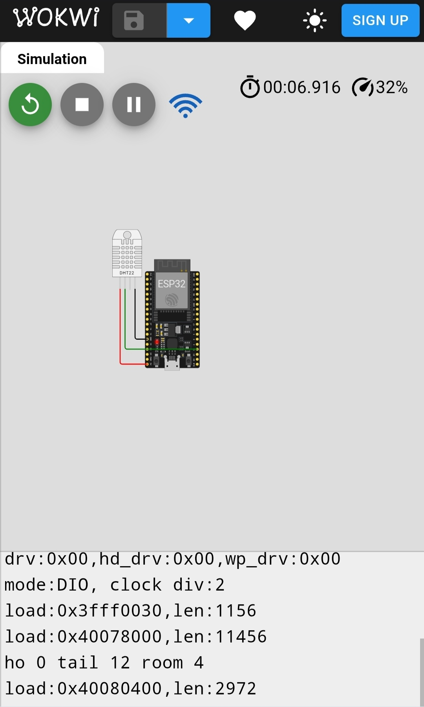

# IOT-based-wheather-station-
An IoT-based Weather Station built with ESP32 and DHT22 sensor.  The project measures temperature and humidity, sends live data to the Blynk IoT App,  and supports Wokwi simulation for testing without hardware.
# 🌦️ IoT Weather Station using ESP32, DHT22, and Blynk

This project is an **IoT-based Weather Station** built with **ESP32** and **DHT22** sensor.  
It measures **temperature** and **humidity**, displays them on the **Serial Monitor**, and also sends live data to the **Blynk IoT App** dashboard.  

## 🚀 Features
- Reads **Temperature (°C)** and **Humidity (%)** using DHT22 sensor  
- Sends real-time data to **Blynk App** via WiFi  
- Displays sensor readings in **Serial Monitor**  
- Can be simulated in **Wokwi** or run on **real ESP32 hardware**  

---

## 🔌 Circuit Diagram
Connections:
- DHT22 VCC → ESP32 5V  
- DHT22 GND → ESP32 GND  
- DHT22 Data → ESP32 GPIO 15  

  

---

## 🌐 Wokwi Simulation
👉 [Click here to open the simulation](https://wokwi.com/projects/442156293216352257)

⚠️ **NOTE FOR WOKWI:**  
- Wokwi does not support direct Blynk cloud connection.  
- If you want to test in Wokwi, **comment out these lines** in `setup()` and `loop()`:
  ```cpp
  Blynk.begin(BLYNK_AUTH_TOKEN, ssid, pass);
  Blynk.run();
  Blynk.virtualWrite(TEMP_VPIN, temp);
  Blynk.virtualWrite(HUMID_VPIN, humid);
